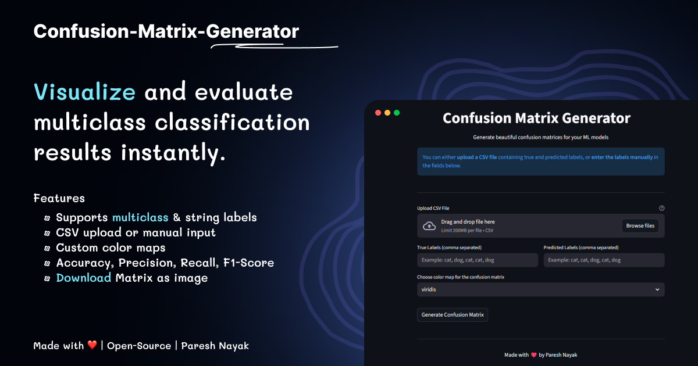

# Confusion Matrix Generator

An open-source Streamlit web app to generate beautiful confusion matrices for multi-class machine learning models. Supports numeric and string labels, CSV upload, manual label entry, custom color maps, and displays evaluation metrics like Accuracy, Precision, Recall, and F1-score. Users can download the confusion matrix as an image.


---



---

## ✨ Features

- Confusion matrices for binary & multi-class models
- Numeric and string label support
- CSV upload or manual input
- Custom color maps
- Accuracy, Precision, Recall & F1-score
- Downloadable matrix image
- Open-source Streamlit web app

---

## 🚀 Live Demo

Try the app live here:

🔗 **https://confusion-matrix-gen.streamlit.app**

No installation required — simply upload a CSV file or enter labels manually and generate confusion matrices instantly.

---

## 🖥️ Run the App Locally (Step-by-Step)

Follow these steps to run the Confusion Matrix Generator on your local machine.

### Step 1: Clone the Repository

Open your terminal and run:

```bash
git clone https://github.com/pareshrnayak/confusion-matrix-generator.git
```

### Step 2: Move into the Project Directory

```bash
cd confusion-matrix-generator
```

### Step 3: Install Dependencies

Make sure `Python` and `pip` are installed before running this command.

```bash
pip install -r requirements.txt
```

> Virtual Environments (`venv`) are optional.
> This works without creating one.

### Step 4: Run the Streamlit App

```bash
python -m streamlit run app.py
```

### Step 5: Open in Browser

Once the app starts, you will see a local URL like:

```bash
http://localhost:8501
```

> Open it in your browser to use the app.


---

## 🤝 Contributing
Contributions, issues, and feature requests are welcome!  
Feel free to fork this repo and submit a pull request.

---

## 🧩 Open Source
This project is open-source and free to use under the MIT License.


